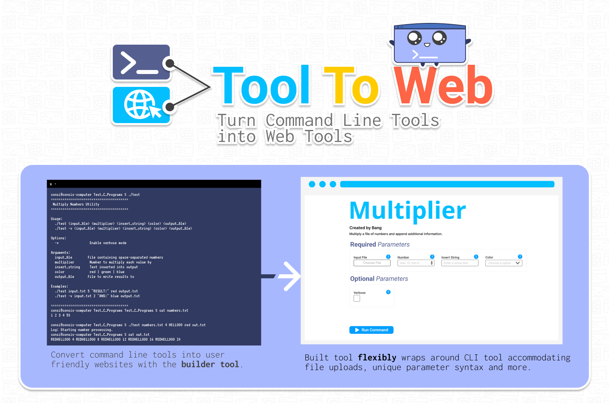

# Overview

This project provides a framework for generating a web-based interface for Unix command-line tools. Given information about a tool, the application can automatically create a web interface that allows users to:

* Provide input
* Execute the tool
* View and retrieve output

This repository is designed to work with files generated from the [builder tool](http://algo.tcnj.edu/tool2web/WebAppForCommandLineUtils/) and helps deploy the final web application.

---

# Getting Started

## 1. Clone the Repository

You can clone the repository using either HTTPS or SSH:

```bash
git clone https://github.com/bangChiem/ToolToWeb.git
```

```bash
git clone git@github.com:bangChiem/ToolToWeb.git
```

Then navigate into the project directory. The following command can be used as a example to navigate into the folder.
```bash
cd YOUR_FILE_PATH_TO_ToolToWeb
```

---

## 2. Prerequisites

Make sure you have **Node.js** installed (npm comes with it).

Check your installation:

```bash
node -v
npm -v
```

* If you see version numbers, you're ready to proceed
* If not, install Node.js from: https://nodejs.org/

---

## 3. Install Dependencies

Run the following command in the directory you just cloned:

```bash
npm install
```

This will:

* Read the `package.json` file
* Install all required dependencies
* Create a `node_modules/` folder
* Generate/update `package-lock.json`

---

## 3. Upload Command Line Tool into Repository.
Place your command-line tool file in the root level of the repository.

**IMPORTANT**: Record the absolute path to this file; you will need it when configuring your web application in the next steps.

To verify the tool is executable within the environment, run:

```
/path/to/your/commandLineTool.file
```


This should execute your command line tool.

If your tool requires multiple files, ensure they are all uploaded to the same directory.

If you have default input files, upload them to the default_files/ directory and record their absolute paths as well.

## 5. Use Builder tool to Create Web Version of Command Line Tool

Visit the [builder tool](http://algo.tcnj.edu/tool2web/WebAppForCommandLineUtils/).

You should see the following:


Follow the [Builder Tool Guide](/docs/BuilderToolGuide.md) on how you can use the builder tool to create a web interface for your command line tool.

## 6. Uploading Files for the Website
Create **a folder** in the tools folder. The name of the folder can be anything you would like however to keep your project organized the name of the folder should be in relation to your command line tool.

Upload the **index.html** and **config.json** you downloaded from the builder tool into this folder you created.

Your directory structure should now look like the following (toolname is the folder you created):


## 7. Run the Project
Make sure you are at the root level of the project directory. You should see the files:
* server.js
* package.json
* package-lock.json
* uploads
* tools

Start the application with:

```bash
node server.js
```
---


# Deployment

To deploy this Node.js application, you can follow a general process:

1. **Choose a hosting environment**
   Select a platform that supports Node.js applications (e.g., cloud providers, virtual private servers, or platform-as-a-service solutions).


3. **Build and transfer your code**

   * Push your code to a remote repository or upload it directly to your server
   * Install dependencies in the deployment environment using `npm install`

4. **Run the application in production**

   * Start the server using a process manager or runtime command
   * Ensure the app runs persistently and restarts on failure

5. **Configure networking**

   * Expose the appropriate port
   * Optionally set up a domain name and HTTPS

6. **Monitor and maintain**

   * Check logs for errors
   * Update dependencies and redeploy as needed


